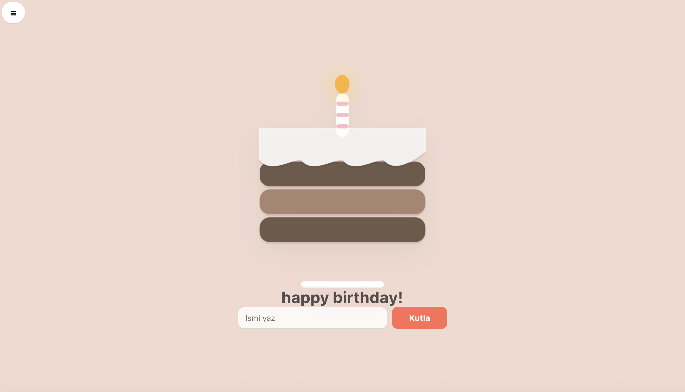
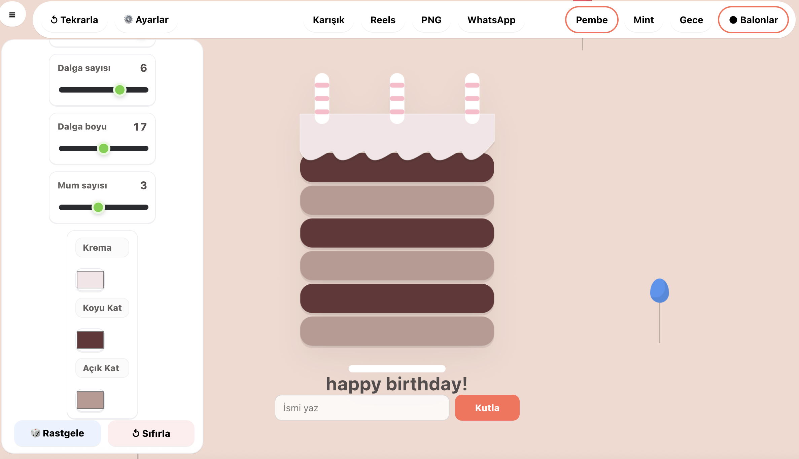

# 🎂 Happy Birthday – Kişiselleştirilebilir Pasta Uygulaması

Merhaba! 👋
Bu mini web projesini tamamen **HTML, CSS ve JavaScript** kullanarak geliştirdim.
Amacım sade ama eğlenceli bir **doğum günü kutlama sayfası** oluşturmak, ismini yazıp “Kutla” butonuna bastığında balonlar uçsun, konfeti yağsın, pasta yanıp sönsün 🍰🎈

---

## ✨ Özellikler

* 🎨 **Kişiselleştirilebilir Pasta:** Kat sayısı, dalga sayısı, dalga boyu ve mum sayısı ayarlanabiliyor.
* 🌈 **Renk Seçimi:** Krema, koyu kat ve açık kat renkleri değiştirilebilir.
* 🧁 **Temalar:** Pembe · Mint · Gece
* 🎉 **Kutlama Efekti:** Balonlar, konfeti ve animasyonlu yazı efekti
* 📸 **PNG Olarak Kaydetme:** Tek tıkla pasta görüntüsünü kaydedebilme
* 🔁 **Rastgele / Sıfırla / Tekrarla** fonksiyonları
* 💬 **WhatsApp & Reels Paylaşımı:** Hazır kare formatta kayıt imkânı

---

## 🧩 Klasör Yapısı

```
cake/
├── index.html        # Ana sayfa
├── style.css         # Tema, renkler ve animasyonlar
└── app.js            # Tüm JS mantığı (tema geçişleri, animasyonlar, PNG kaydetme)
```

---

## 💻 Kullanılan Teknolojiler

Bu proje tamamen saf web teknolojileriyle geliştirildi — framework veya kütüphane yok.

| Teknoloji                    | Açıklama                                                          |
| ---------------------------- | ----------------------------------------------------------------- |
| **HTML5**                    | Sayfa yapısı ve kullanıcı arayüzü                                 |
| **CSS3**                     | Temalar, renk geçişleri ve animasyon efektleri                    |
| **Vanilla JavaScript (ES6)** | Tüm etkileşimler, tema değişimi, PNG kaydetme, animasyon kontrolü |
| **Canvas & html2canvas**     | Pasta ekranını PNG olarak dışa aktarma                            |
| **LocalStorage (opsiyonel)** | Ayarların geçici olarak tutulması                                 |
| **SVG / Emoji efektleri**    | Balonlar, konfeti ve mum ışığı efektleri                          |

---

## 🖼️ Ekran Görüntüleri

| Açılış Ekranı                    | Pasta Düzenleme                       | Kutlama                      |
| -------------------------------- | ------------------------------------- | ---------------------------- |
|  |  |  |

Ek olarak, proje klasörümün Finder görünümü 👇


---

## 🚀 Nasıl Çalıştırılır

Projeyi çalıştırmak için sadece `index.html` dosyasını açman yeterli.
İstersen küçük bir yerel sunucu kurarak da test edebilirsin:

```bash
# Python ile
python3 -m http.server 5173

# veya Node.js ile
npx serve -p 5173
```

Sonra tarayıcıdan şu adrese git:
👉 [http://localhost:5173](http://localhost:5173)

---

## 🎨 Tema Örnekleri

* **Pembe Tema:** Klasik doğum günü havası 🎀
* **Mint Tema:** Ferah, yumuşak pastel tonlar 🌿
* **Gece Modu:** Koyu arka plan, parlak mum efekti 🌙

---

## 🧠 Notlar

Bu proje tamamen eğlence amaçlıydı ama sonrasında görsel olarak epey tatlı hale geldi 😄
Basit yapısı sayesinde hem yeni başlayanlar hem de web animasyonlarına ilgi duyanlar için güzel bir örnek.
Gelecekte müzik, paylaşılabilir bağlantılar ve tema kaydetme özelliklerini eklemeyi planlıyorum.

---

## 📜 Lisans

Kişisel bir mini proje — isteyen herkes alıp deneyebilir, düzenleyebilir ve paylaşabilir.
Tek kural: **kutlamayı keyifle yapın! 🎉**

